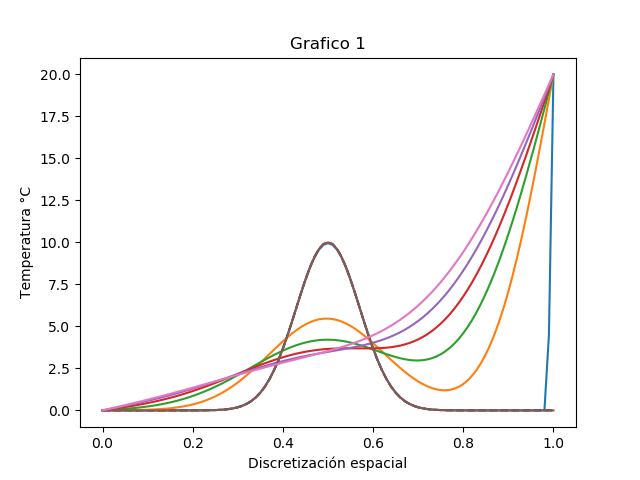
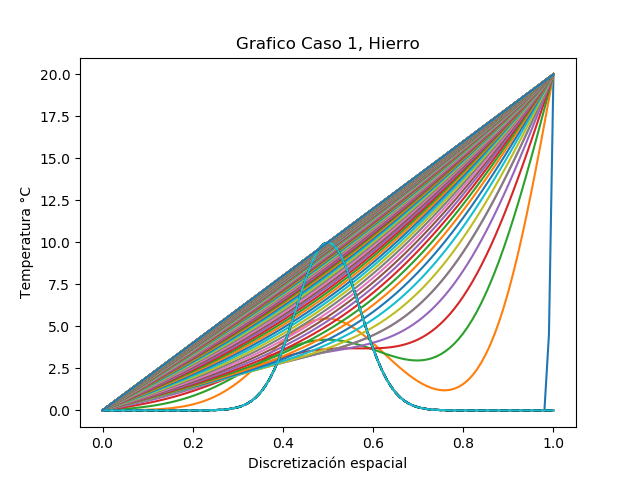

# MCOC-Proyect-1
Proyecto 1 MCOC
*****************
```
Integrantes:
Tomás García
Javier Marín
Rodrigo Molina
Mauricio Sánchez
```

CASO 1
*******




Como se puede ver en la imagen anterior, a medida que se evalua la difusión de calor por más tiempo, la curva de temperatura empieza a estabilizarse, casi formanod una recta. Sin embagro llega un minuto en que no vale la pena seguir evaluando la difusión puesto que la diferencia es tan leve que no se nota al ojo humano, y numericamente es despreciable.

